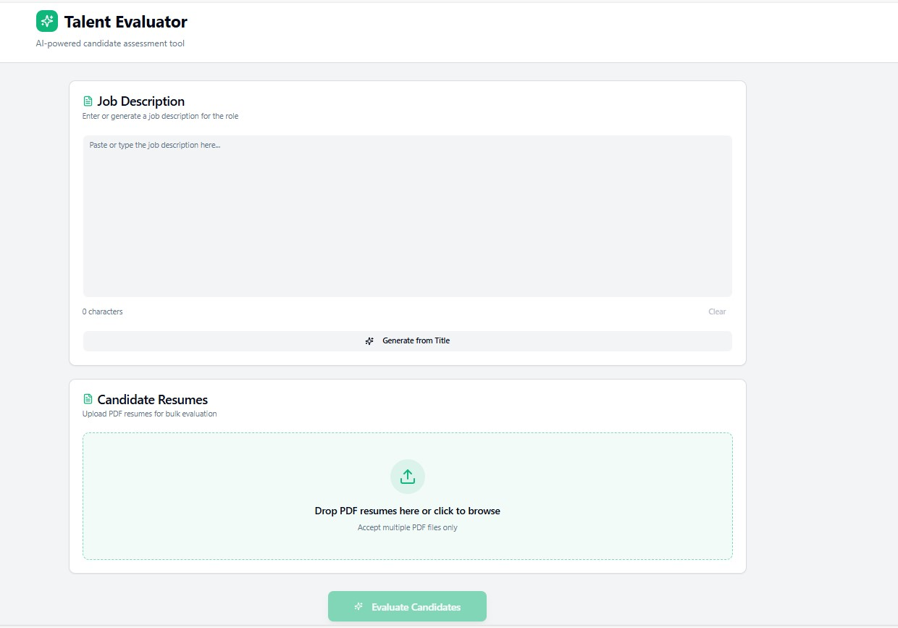
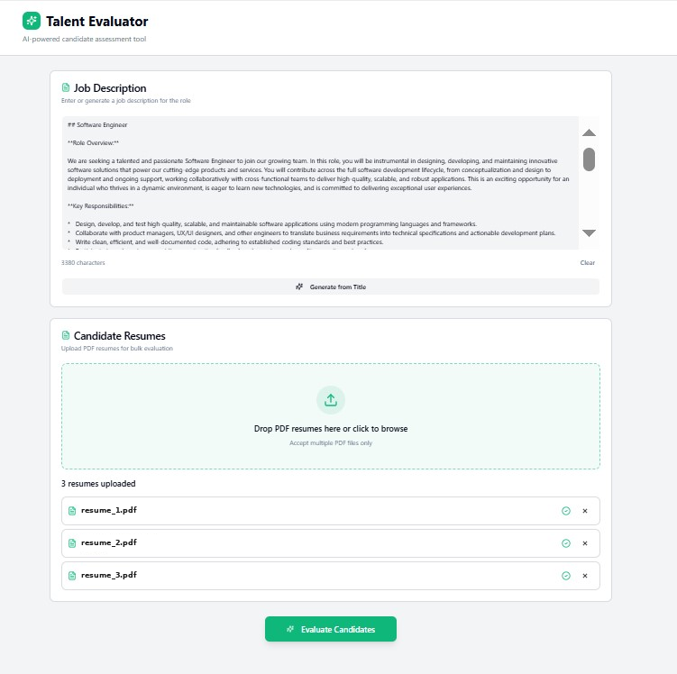
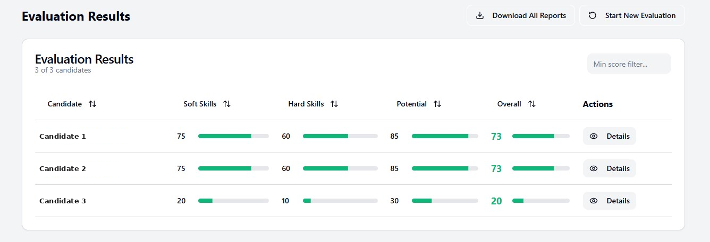
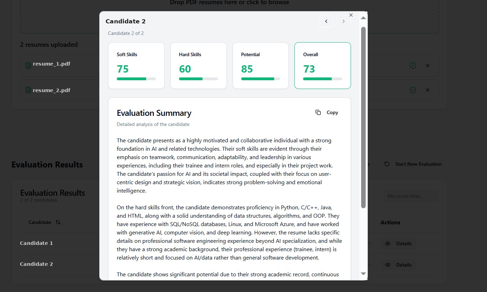

# Talent Evaluator

**AI-Powered Candidate Assessment System**  
*Streamlining Your Recruitment Process*

---

## 📌 Overview

**Talent Evaluator** is an intelligent recruitment assistant designed to make hiring faster, fairer, and more effective. Instead of manually reviewing dozens of resumes, the system automatically analyzes candidate qualifications against specific job requirements and generates comprehensive evaluation reports.

---

## 🎯 Key Problems Solved

Talent Evaluator addresses several common challenges in traditional recruitment:

* **Time-consuming manual screening:** Eliminates long hours spent scanning resumes.
* **Inconsistent evaluation criteria:** Prevents shifting standards when assessing different candidates.
* **Risk of unconscious bias:** Reduces subjective bias during initial candidate screening.
* **Difficulty in objective comparisons:** Makes it easy to compare candidates on equal grounds.
* **Volume limitations:** Manages high application volumes without adding overhead.

---

## 🚀 How It Works

### 1. Enter the job description

Paste or type a job description, or click **Generate from Title** to let AI write one.

### 2. Upload candidate resumes

Drag and drop one or more PDF resumes. Each uploaded file is listed and can be removed before evaluation.

### 3. Run the evaluation

Click **Evaluate Candidates**. Every resume is scored against the job description.

### 4. Review the results

All candidates appear in a sortable table with scores for each dimension. You can filter by minimum score, download all reports, or start a new evaluation.

Click **Details** on any candidate to see their scores and a written evaluation summary covering soft skills, hard skills, and potential. Use the arrows to move between candidates, or **Copy** to copy the summary.

> Candidate names and file names in these screenshots have been replaced with placeholders for privacy.

---

## 📊 Evaluation Dimensions

Candidates are evaluated across four key dimensions:

| Metric | What It Measures | Why It Matters |
| :--- | :--- | :--- |
| **Soft Skills** | Communication, teamwork, adaptability, leadership, problem-solving | Predicts cultural fit and collaboration success |
| **Hard Skills** | Technical abilities, programming languages, tools, certifications | Ensures candidate can perform core job tasks |
| **Potential** | Growth trajectory, learning capacity, innovation, motivation | Identifies future high-performers |
| **Overall** | Comprehensive fit combining all metrics | Provides a holistic candidate assessment |

---

## 💡 Key Benefits

* ⏱️ **Save Time:** Screen dozens of resumes in minutes instead of days.
* 📈 **Objective Data:** Make decisions based on consistent, quantifiable metrics.
* 🎯 **Better Quality:** Uncover top talent that might otherwise be overlooked.
* ⚙️ **Improved Process:** Standardize screening criteria across all roles.
* 📄 **Documentation:** Generate professional reports for compliance and archiving.
* 🔄 **Scalability:** Scale hiring volume easily without extra resources.

---

## 👥 Who Is It For?

* **HR Teams:** Streamline workflows and improve time-to-hire metrics.
* **Hiring Managers:** Gain data-driven insights for confident decisions.
* **Recruiters:** Handle higher application loads without sacrificing quality.
* **Small Businesses:** Access enterprise-grade screening without dedicated HR staff.
* **Growing Companies:** Scale recruitment rapidly during expansion phases.

---

## 🛠️ Technology Stack

Talent Evaluator uses natural language processing and multi-agent AI workflows to understand both job requirements and candidate qualifications:

* **[Lovable.ai](https://lovable.ai)** – Web application front end
* **[CrewAI](https://crewai.com)** – Multi-agent evaluation pipeline